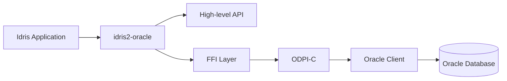
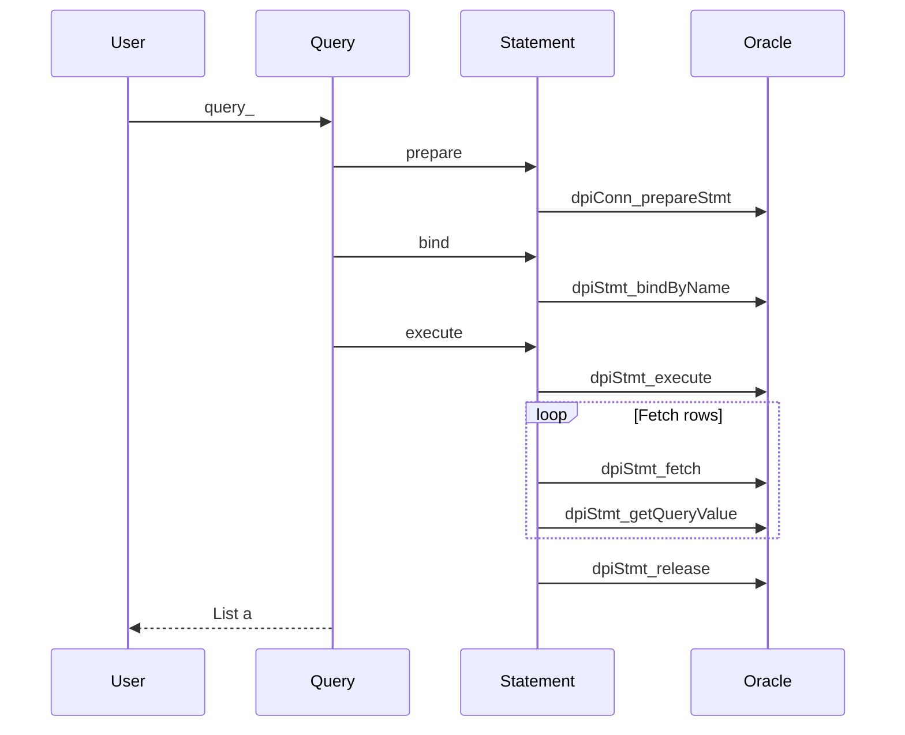
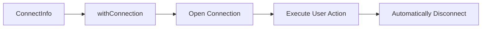
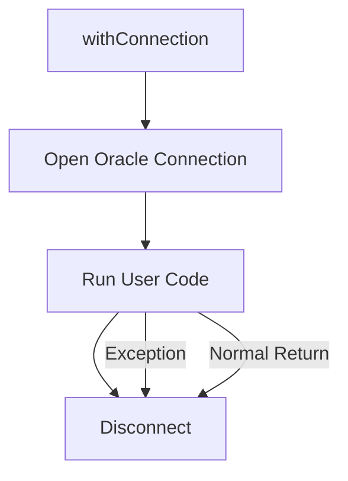
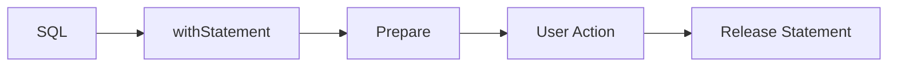
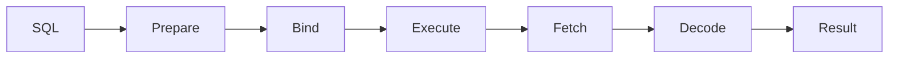
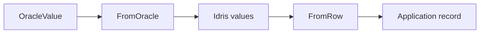
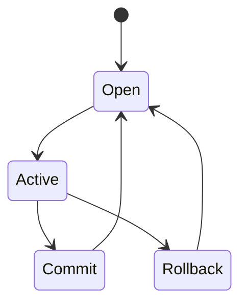
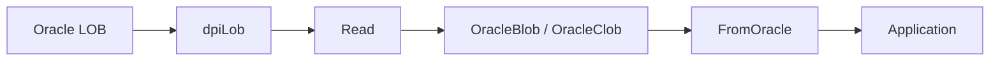
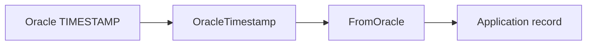

# Idris2 bindings to the Oracle ODPI-C API

This library provides a modern Oracle Database client library for Idris2 built on top of Oracle's [ODPI-C API](https://github.com/oracle/odpi). It combines a low-level FFI with a high-level, type-safe API supporting prepared statements, transactions, typed row decoding, LOBs, and Oracle-native data types, allowing Idris2 applications to interact with Oracle databases safely and efficiently.

> [!NOTE]
> The internals of this library heavily utilize the [idris2-ref1](https://github.com/stefan-hoeck/idris2-ref1), [idris2-elin](https://github.com/stefan-hoeck/idris2-elin) and [idris2-json](https://github.com/stefan-hoeck/idris2-json/tree/main) libraries, so you may want to familiarize yourself with them first.

## Building

Running `make build` builds the library (this can also be done via `pack build`).

## Installation

This library depends on Oracle’s ODPI-C layer, and ODPI-C in turn requires Oracle Client libraries at runtime.
Oracle’s documentation states that these libraries can come from Oracle Instant Client, an Oracle Database installation, or a full Oracle Client installation. ODPI-C also loads the client library dynamically at runtime, so the application must be able to locate the Oracle Client shared libraries when it starts.

Running `make install` installs the library.

## Features

- **Complete Oracle connectivity**
  - Connect and disconnect from Oracle databases
  - Transaction management
  - Automatic cleanup of database resources
- **Prepared statements**
  - Prepare SQL once and execute multiple times
  - Named parameter binding
  - Automatic statement lifetime management
  - Statement reuse
- **Rich type support**
  - `VARCHAR2`
  - `NUMBER`
  - `BOOLEAN`
  - `CLOB`
  - `BLOB`
  - `TIMESTAMP`
  - `TIMESTAMP WITH TIME ZONE`
  - `INTERVAL YEAR TO MONTH`
  - `INTERVAL DAY TO SECOND`
  - `JSON` (via `idris2-json`)
- **Typed decoding**
  - Automatic conversion from Oracle values to Idris types via `FromOracle`
  - Automatic row decoding via `FromRow`
  - Typed query APIs returning user-defined records
- **Type-safe parameter encoding**
  - Automatic conversion to Oracle bind values via `ToOracle`
  - Record encoding through `ToRow`
- **LOB support**
  - Read and write `CLOB`
  - Read and write `BLOB`
  - Automatic LOB resource management
- **Transaction support**
  - Commit
  - Rollback
- **Error handling**
  - Oracle errors are represented as ordinary Idris values
  - Rich diagnostic information
- **Resource safety**
  - Automatic release of
    - statements
    - query metadata
    - temporary buffers
    - LOB handles
  - Bracket-style APIs throughout (via `idris2-elin`)
- **High-level query interface**
  - Raw queries returning `OracleValue`
  - Typed queries returning Idris records
  - Single-row queries
  - Exactly-one-row queries
- **Comprehensive test suite**
  - Connection tests
  - Statement tests
  - Parameter binding tests
  - Query tests
  - Typed decoding tests
  - Transaction tests

## Why use this library?

Most Oracle client libraries fall into one of two categories:

- Thin C bindings that expose Oracle's underlying APIs almost directly. While these provide maximum flexibility, they also require callers to manually manage statements, buffers, LOB locators, and other native resources. Small mistakes can easily lead to memory leaks or invalid resource usage.
- Heavyweight object-relational frameworks that hide much of Oracle's functionality behind large abstraction layers. These often sacrifice transparency, make advanced Oracle features difficult to access, and provide little static verification of application logic.

This library aims for a middle ground between the aforementioned categories.
It exposes Oracle's capabilities through a small, composable API while using Idris2's type system to eliminate many classes of runtime errors. Resources are managed automatically, database values are represented explicitly, and query results can be decoded directly into ordinary Idris records without reflection or runtime code generation.

Since the library is built directly on Oracle's officially supported ODPI-C layer, it also inherits the portability, performance, and compatibility of Oracle's native client implementation while presenting a purely functional Idris2 interface.

## Architecture



This library is built as a small Idris2 layer on top of Oracle’s ODPI-C library. ODPI-C provides the low-level bridge to Oracle Client libraries and the database itself, while this library adds a type-safe Idris2 API for connections, statements, transactions, parameter binding, row decoding, and LOB handling.

At the highest level, applications work with ordinary Idris2 values and records. Those values are translated into `OracleValue`s and bind parameters, and query results are translated back through `FromOracle` and `FromRow` instances.

A typical query therefore flows through the library like this:



## Connecting to Oracle

The recommended way to establish a connection is with `withConnection`.

`withConnection` automatically opens the connection before executing your action and guarantees that the connection is released afterwards, even if an error occurs. This mirrors the rest of the library's resource-management philosophy and should be preferred over calling `connect` and `disconnect` manually.



A typical application begins by constructing a `ConnectInfo` value.

```idris
connectInfo : ConnectInfo
connectInfo =
  MkConnectInfo
    "idris"
    "password"
    "localhost"
    1521
    "FREEPDB1"
```

A connection can then be used like this:

```idris
main : IO ()
main =
  withConnection connectInfo $ \conn => do
    putStrLn "Successfully connected!"
```

Notice that the connection is never explicitly closed. Once the supplied function returns, `withConnection` automatically disconnects from Oracle.

### Why use `withConnection`?

Every connection to Oracle consumes database and client resources.

If a program exits early because of an exception or returns from multiple branches, manually calling `disconnect` becomes easy to forget.

Using `withConnection` avoids these problems entirely.



For this reason, nearly every example in this tutorial uses `withConnection`.

### Manual connections

Advanced applications may wish to manage connection lifetimes manually.

For those situations the lower-level API is available:

```idris
result <- connect connectInfo

case result of
  Left err =>
    putStrLn (show err)

  Right conn => do
    ...
    disconnect conn
```

This is occasionally useful for long-running services, but most applications should prefer `withConnection`.

## Executing SQL

Once connected, SQL statements can be executed with `execute_`.

`execute_` is intended for SQL that does not return rows, including:

- `CREATE TABLE`
- `CREATE INDEX`
- `INSERT`
- `UPDATE`
- `DELETE`
- `ALTER`
- `DROP`

For example:

```idris
withConnection connectInfo $ \conn =>
  execute_
    conn
    """
    CREATE TABLE people
    (
        id NUMBER PRIMARY KEY,
        name VARCHAR2(100)
    )
    """
    []
```

Every execution returns:

```idris
Either OracleError ()
```

Most database operations therefore follow the pattern:

```idris
result <-
  execute_
    conn
    sql
    params

case result of
  Left err =>
    ...

  Right () =>
    ...
```

## Prepared Statements

Although `execute_` is convenient, Oracle performs best when SQL statements are prepared once and reused.

This library exposes prepared statements through the `Statement` type.

Like `withConnection`, `withStatement` (the recommended way to create a statement) automatically manages the lifetime of the underlying Oracle resource.



A prepared statement looks like this:

```idris
withStatement conn
  """
  INSERT INTO people(name, age)
  VALUES(:name, :age)
  """
  $ \stmt => do

    ...
```

When the callback returns, the prepared statement is automatically released.

Even if an exception occurs while executing the statement, Oracle resources are still cleaned up correctly.

### Why `withStatement`?

Oracle statements are native resources allocated by ODPI-C.

Forgetting to release them can leak memory and database handles.

Using `withStatement` guarantees that every prepared statement has a matching release.

This is the same design philosophy used throughout the library:

- `withConnection`
- `withStatement`
- `withQueryInfo`

Each acquires a resource, executes user code, and guarantees cleanup.

## Bind Parameters

Rather than constructing SQL strings manually, applications should bind values through named parameters.

Binding provides several advantages:

- avoids SQL injection
- improves statement reuse
- avoids manual quoting
- allows Oracle to optimize execution

A bind parameter consists of a parameter name and an `OracleValue`.

For example:

```idris
MkBindParameter
  ":name"
  (OracleString "Alice")
```

Multiple parameters are simply collected into a list:

```idris
[
  MkBindParameter
    ":name"
    (OracleString "Alice")

, MkBindParameter
    ":age"
    (OracleNumber 30)
]
```

These correspond to placeholders inside the SQL statement.

```sql
INSERT INTO people
(
    name,
    age
)
VALUES
(
    :name,
    :age
)
```

The library automatically binds each parameter before executing the statement.

### Supported bind types

The library currently supports binding:

- `OracleNull`
- `OracleString`
- `OracleNumber`
- `OracleBool`
- `OracleClob`
- `OracleBlob`
- `OracleTimestamp`
- `OracleTimestampTZ`
- `OracleIntervalYM`
- `OracleIntervalDS`

Additional Oracle types will be added over time as support is implemented.

### Encoding user types

Applications rarely need to construct `BindParameter` values manually.

Instead, user-defined records can implement the `ToRow` interface.

```idris
implementation ToRow Person where
  toRow person =
    [
      MkBindParameter
        ":name"
        (OracleString person.name)

    , MkBindParameter
        ":age"
        (OracleNumber person.age)
    ]
```

Once a `ToRow` instance exists, records can be converted into bind parameters automatically, allowing the application's domain model to remain independent of Oracle-specific types.

## Querying

Retrieving data from Oracle begins with one of the query functions provided by the library.

At the lowest level, queries return rows of `OracleValue`s exactly as they are represented by Oracle.

```idris
queryRaw
    : Connection
   -> String
   -> List BindParameter
   -> IO (Either OracleError (List (List OracleValue)))
```

A query therefore returns a list of rows, where each row is a list of `OracleValue`s.

For example,

```sql
SELECT
    name,
    age
FROM people
ORDER BY id
```

Might produce:

```idris
Right
[
    [ OracleString "Alice"
    , OracleNumber 30
    ]
,   [ OracleString "Bob"
    , OracleNumber 42
    ]
]
```

This representation is intentionally simple. Every Oracle datatype has a corresponding `OracleValue` constructor, allowing callers to inspect values without committing to a particular Idris type.

Most applications, however, should rarely need to work directly with `OracleValue`.

### Query lifecycle

Every query follows the same execution pipeline.



Internally this corresponds to:

1. Preparing the SQL statement
2. Binding parameters
3. Executing the statement
4. Fetching every row
5. Decoding Oracle values
6. Returning the result

Because `queryRaw` uses `withStatement`, the prepared statement is released automatically before the function returns.

## Typed Queries

While `queryRaw` exposes Oracle values directly, most Idris programs are interested in ordinary Idris records.

For that reason the library provides

```idris
query_
    : FromRow a
    => Connection
    -> String
    -> List BindParameter
    -> IO (Either OracleError (List a))
 ```

which automatically decodes every row using the `FromRow` interface.

Suppose we have:

```idris
record Person where
    constructor MkPerson
    name : String
    age  : Double

implementation FromRow Person where
    ...
```

Then querying becomes:

```idris
people <-
    query_
        conn
        """
        SELECT
            name,
            age
        FROM people
        """
        []
```

The result is then:

```idris
Either OracleError (List Person)
```

Instead of:

```idris
Either OracleError
    (List (List OracleValue))
```

This removes nearly all manual decoding from application code.

## The decoding pipeline

The conversion from Oracle rows into Idris records happens in two stages.



`FromOracle`

: Converts an individual Oracle value into a single Idris value.

`FromRow`

: Combines several decoded values into an application record.

This separation allows primitive conversions to be reused across every record type in the application.

## Querying a single row

Frequently a query is expected to return at most one row.

For these situations the library provides

```idris
queryOne
    : FromRow a
    => Connection
    -> String
    -> List BindParameter
    -> IO (Either OracleError (Maybe a))
```

Suppose we have:

```idris
employee <-
    queryOne
        conn
        """
        SELECT
            name,
            age
        FROM people
        WHERE id = :id
        """
        [
            MkBindParameter
                ":id"
                (OracleNumber 1)
        ]

```

The result is then:

```idris
Either OracleError (Maybe Person)
```

`queryOne` makes the absence of a matching row explicit.

## Requiring exactly one row

Sometimes returning zero rows is an error (primary-key lookups are a common example).

For these situations, the library provides:

```idris
queryExactlyOne
    : FromRow a
    => Connection
    -> String
    -> List BindParameter
    -> IO (Either OracleError a)
```

`queryExactlyOne` fails if:

- No rows are returned
- More than one row is returned

This eliminates an entire class of application-level checks.

## Transactions



Oracle transactions are controlled explicitly through the `Connection`.

The library exposes the two standard transaction operations:

- `commit`
- `rollback`

A typical transaction looks like

```idris
execute_ conn insertPerson alice
>>== \_ =>
execute_ conn insertPerson bob
>>== \_ =>
commit conn
```

If an error occurs before the final commit,

```idris
rollback conn
```

returns the database to its previous state.

## Why explicit transactions?

Grouping several statements into one transaction provides:

- atomicity
- consistency
- isolation
- durability

Transactions also reduces unnecessary commits, and is almost always preferable to committing after every statement.

## Working with LOBs

Oracle supports two large-object types:

- `CLOB`
- `BLOB`

These are represented as

```idris
OracleClob String
OracleBlob ByteString
```

Unlike ordinary strings and byte arrays, Oracle stores LOBs through dedicated LOB locators.

Reading a BLOB produces

```idris
OracleBlob bytes
```

Reading a CLOB produces

```idris
OracleClob text
```

Internally the library acquires the LOB locator, reads its contents, releases temporary buffers, and returns ordinary Idris values.

## LOB pipeline



Applications therefore never manipulate native LOB handles directly.

## Dates, Times, and Intervals

Oracle provides several temporal datatypes.

The library currently supports:

| Oracle datatype            |  Idris representation |
| -------------------------- | --------------------- |
| `TIMESTAMP`                |  `OracleTimestamp`    |
| `TIMESTAMP WITH TIME ZONE` | `OracleTimestampTZ`   |
| `INTERVAL YEAR TO MONTH`   | `OracleIntervalYM`    |
| `INTERVAL DAY TO SECOND`   | `OracleIntervalDS`    |

For example,

```idris
MkOracleTimestamp
    2025
    7
    10
    14
    30
    15
    123456789
```

Represents:

```text
2025-07-10 14:30:15.123456789
```

Similarly,

```idris
MkOracleIntervalYM
    3
    6
```

Represents an interval of three years and six months.

These values participate naturally in both encoding and decoding.



The same mechanism works for every supported temporal type.

Applications therefore interact with strongly typed Idris values instead of parsing date and interval strings manually.

## Error Handling

Unlike many database libraries, this library does not throw exceptions for ordinary database failures.

Instead, every database operation explicitly returns either a successful result or an `OracleError`.

```idris
Either OracleError a
```

This makes failure part of the function's type and encourages applications to handle database errors explicitly.

A typical query therefore looks like:

```idris
result <-
    query_
        conn
        sql
        params
case result of
    Left err =>
        putStrLn (show err)
    Right rows =>
        ...
```

## The `OracleError` type

Every Oracle failure is represented by an `OracleError`:

```idris
record OracleError where
  constructor MkOracleError
  code        : Int32
  message     : String
  fnname      : String
  recoverable : Bool
```

An error contains information such as:

- Oracle error number
- Descriptive error message
- The function where the fail originated from
- Whether the error originated from Oracle or the library

For example,

```text
ORA-00942: table or view does not exist
```

Becomes an ordinary Idris value that can be inspected, logged, transformed, or propagated.

## Error propagation

Most library functions return

```idris
IO (Either OracleError a)
```

This allows callers to propagate failures naturally.

For example,

```idris
execute_ conn sql params
>>== \_ =>
commit conn
```

If the first operation fails, the second operation is never executed.

This keeps transaction logic concise while avoiding deeply nested pattern matches.

## Advanced Usage

Most users will only need the high-level API presented throughout this tutorial.

However, this library also exposes the underlying layers for applications requiring finer control over Oracle.

These include:

- Manual connection management
- Prepared statement reuse
- Raw query APIs
- Low-level ODPI-C bindings
- Custom row decoding
- Custom parameter encoding

## Manual connection management

Although this tutorial strongly recommends using

```idris
withConnection
```

There are situations where manually managing connections is appropriate.

Examples include:

- long-running servers
- custom connection pools
- embedded frameworks
- interoperability with existing resource managers

The lower-level API consists of

```idris
connect
disconnect
```

Applications using these functions become responsible for ensuring every successful connection is eventually released.

## Working directly with `OracleValue`

Most applications should use typed queries.

Occasionally, however, the schema may not be known until runtime.

In these situations, you can use `queryRaw`:

```idris
queryRaw
    : Connection
    -> String
    -> List BindParameter
    -> IO (Either OracleError (List (List OracleValue)))
```

This allows applications to inspect Oracle values dynamically.

This is useful for:

- Generic SQL clients
- Schema browsers
- Migration tools
- Interactive REPLs

## Custom decoding

Every typed query is built from two interfaces:

```idris
FromOracle
FromRow
```

Applications can define new instances to decode Oracle values directly into domain-specific types.

Similarly, `ToRow` allows records to be converted into collections of bind parameters.

This separation keeps database-specific logic isolated from application code.

## Queries

The query API provides two levels of access to Oracle query results.

At the lower level, queries return Oracle values directly:

- `query` retrieves all rows
- `queryOne` retrieves a single row

At the higher level, `queryAs` and `queryOneAs` decode query results directly into user-defined Idris types using the `FromOracle` interface.

Queries are represented by the `Query` record, while individual selected expressions are represented by `QueryColumn`.

### `Query`

A `Query` describes a complete SQL query:

```idris
public export
record Query where
  constructor MkQuery
  columns : List QueryColumn
  querybody : String
  binds : List BindParameter
```

The `columns` field describes the expressions selected by the query.

The `querybody` field contains the remainder of the SQL query, beginning with the `FROM` clause and including any additional clauses required to identify or order the result rows.

The `binds` field contains the bind parameters used by the query.

For example:

```idris
MkQuery
  [ QueryColumn "id"
  , QueryColumn "name"
  ]
  "people WHERE active = :active ORDER BY id"
  [MkBindParameter ":active" (OracleBool True)]
```

Represents a query equivalent to:

```sql
SELECT id, name
FROM people
WHERE active = :active
ORDER BY id
```

The `Query` abstraction allows the query execution layer to know how each selected expression should be retrieved and decoded.

### `QueryColumn`

A `QueryColumn` describes one expression in the `SELECT` list.

A column can represent an ordinary Oracle expression or a JSON expression.

Conceptually, the two forms are:

```idris
QueryColumn "name"
```

And:

```idris
QueryColumnJSON "profile"
```

An ordinary column is selected directly:

```sql
SELECT name
FROM people
```

A JSON column is internally transformed into a textual CLOB representation:

```sql
SELECT JSON_SERIALIZE(profile RETURNING CLOB)
FROM people
```

This allows native Oracle JSON values to be retrieved through the same CLOB handling already used by the library.

Oracle's `JSON_SERIALIZE` function converts JSON data into textual JSON and supports `CLOB` as a return type, making it suitable for retrieving JSON values that may exceed the size of a normal `VARCHAR2` result.

The JSON transformation is an implementation detail of query execution. Users do not need to manually write `JSON_SERIALIZE` when using `QueryColumnJSON`.

For example:

```idris
MkQuery
  [ QueryColumn "id"
  , QueryColumn "name"
  , QueryColumnJSON "profile"
  ]
  "people"
  []
```

Is logically equivalent to:

```sql
SELECT
    id,
    name,
    JSON_SERIALIZE(profile RETURNING CLOB)
FROM people
```

This means a query may contain any mixture of ordinary and JSON columns.

For example:

```idris
MkQuery
  [ QueryColumn "id"
  , QueryColumnJSON "profile"
  , QueryColumn "name"
  ]
  "people WHERE id = :id"
  [MkBindParameter ":id" (OracleNumber 1)]
```

The selected expressions are therefore:

1. `id` — ordinary Oracle value
2. `profile` — JSON value serialized to a CLOB
3. `name` — ordinary Oracle value

The resulting row can then be decoded into an Idris record containing both ordinary fields and JSON-derived fields.

## Typed Queries

The typed query API allows query results to be decoded directly into Idris data types.

A type used with `queryAs` or `queryOneAs` must have an appropriate `FromOracle` implementation.

For example:

```idris
public export
record Person where
  constructor MkPerson
  id      : Int
  name    : String
  profile : MyProfile
```

Where `MyProfile` is a JSON-decodable type.

The JSON value is first retrieved from Oracle as serialized JSON text and then decoded into the target Idris type.

### queryAs

`queryAs` executes a query and decodes every returned row into the requested Idris type.

```idris
queryAs
  : FromOracle a
  => Connection
  -> Query
  -> IO (Either OracleError (List a))
```

For example:

```idris
queryAs
  conn
  (MkQuery
    [ QueryColumn "id"
    , QueryColumn "name"
    , QueryColumnJSON "profile"
    ]
    "people ORDER BY id"
    [])

```

Returns:

```idris
Either OracleError (List Person)
```

Assuming an appropriate `FromOracle Person` implementation exists.

The query may return zero or more rows.

A successful query with no matching rows returns:

```idris
Right []
```

A query or decoding failure returns:

```idris
Left error
```

### queryOneAs

`queryOneAs` executes a query and decodes exactly one returned row into the requested Idris type.

```idris
queryOneAs
  : FromOracle a
  => Connection
  -> Query
  -> IO (Either OracleError a)
```

For example:

```idris
queryOneAs
  conn
  (MkQuery
    [ QueryColumn "id"
    , QueryColumn "name"
    , QueryColumnJSON "profile"
    ]
    "people WHERE name = :name"
    [MkBindParameter ":name" (OracleString "Alice")])
```

Returns a single `Person`.

If the query does not return a row, `queryOneAs` returns an `OracleError`.

If the query returns more than one row, the behavior is determined by the implementation's single-row query semantics and should be documented explicitly. Queries passed to `queryOneAs` should therefore normally identify at most one row, for example by using a primary key or another unique predicate.

## JSON Query Columns

JSON support is integrated into the general query API through `QueryColumn`.

This means JSON is not a separate query mechanism. A query can contain ordinary Oracle columns and JSON columns simultaneously.

For example:

```idris
MkQuery
  [ QueryColumn "id"
  , QueryColumn "name"
  , QueryColumnJSON "profile"
  ]
  "people WHERE name = :name"
  [MkBindParameter ":name" (OracleString "Alice")]
```

The query execution layer generates SQL equivalent to:

```sql
SELECT
    id,
    name,
    JSON_SERIALIZE(profile RETURNING CLOB)
FROM people
WHERE name = :name
```

The serialized JSON is retrieved as a CLOB, converted to an Idris `String`, and then passed through the normal `FromOracle` decoding pipeline.

This design has several advantages:

- JSON-specific SQL generation remains inside the query layer.
- The C shim does not require JSON-specific logic.
- JSON values use the existing CLOB retrieval mechanism.
- A single query can mix JSON and non-JSON columns.
- Typed queries can decode JSON directly into nested Idris data types.
- `queryAs` and `queryOneAs` provide the same API regardless of whether a result contains JSON columns.

The user therefore only needs to indicate which selected expressions contain JSON.

## Example: Typed JSON Result

Consider a JSON document stored in the `profile` column:

```json
{
  "department": "Engineering",
  "skills": [
    "Idris2",
    "Haskell",
    "C"
  ],
  "active": true
}
```

An Idris representation might be:

```idris
public export
record Profile where
  constructor MkProfile
  department : String
  skills     : List String
  active     : Bool
```

The enclosing row can then be represented as:

```idris
public export
record PersonProfile where
  constructor MkPersonProfile
  id      : Int
  name    : String
  profile : Profile
```

The query can select both normal and JSON columns:

```idris
queryOneAs
  conn
  (MkQuery
    [ QueryColumn "id"
    , QueryColumn "name"
    , QueryColumnJSON "profile"
    ]
    "people WHERE name = :name"
    [MkBindParameter ":name" (OracleString "Alice")])
```

The resulting value is decoded into:

```idris
PersonProfile
```

With the nested JSON document decoded into:

```idris
Profile
```

This allows JSON stored in Oracle to be treated as a normal typed component of an Idris query result.

## Raw Queries vs Typed Queries

The two query APIs serve different purposes.

### Raw query API

Use `query` and `queryOne` when:

- The result shape is dynamic
- The caller needs to inspect Oracle values directly
- The result does not map naturally to a predefined Idris record
- The caller wants to perform custom decoding

Example:

```idris
query
  conn
  (MkQuery
    [ QueryColumn "id"
    , QueryColumnJSON "profile"
    ]
    "people"
    [])
```

This returns raw Oracle values.

### Typed query API

Use `queryAs` and `queryOneAs` when:

- The result shape is known
- The caller has an Idris record representing the row
- JSON should be decoded into nested Idris types
- The application wants compile-time structure around query results

Example:

```idris
queryOneAs
  conn
  (MkQuery
    [ QueryColumn "id"
    , QueryColumn "name"
    , QueryColumnJSON "profile"
    ]
    "people WHERE name = :name"
    [MkBindParameter ":name" (OracleString "Alice")])
```

The typed API is generally preferred for application-level code, while the raw API is useful for lower-level or dynamic database access.

## Query Design

The `Query` and `QueryColumn` abstractions intentionally separate three concerns:

1. **What is selected**

    Represented by `QueryColumn`.

2. **How rows are located**

    Represented by `querybody`.

3. **How bind parameters are supplied**

    Represented by `binds`.

This separation allows the query layer to transform special column types, such as JSON, without requiring callers to manually construct database-specific SQL.

It also provides a natural extension point for future column representations that require SQL-level transformations before being decoded by Idris.

For example, JSON columns can be transformed using:

```sql
JSON_SERIALIZE(expression RETURNING CLOB)
```

While the rest of the query remains unchanged.

The resulting architecture is therefore:

```text
                   Query
                     |
          +----------+----------+
          |                     |
     QueryColumn           QueryColumnJSON
          |                     |
          |             JSON_SERIALIZE(... CLOB)
          |                     |
          +----------+----------+
                     |
                 Oracle SQL
                     |
                Query Result
                     |
              OracleValue rows
                     |
                FromOracle
                     |
                Idris Type
```

The important property is that JSON handling is performed at the query-expression level rather than by modifying the low-level Oracle value retrieval path. This keeps the existing C shim and general Oracle decoding machinery independent of JSON-specific behavior.

## Testing

This library includes a comprehensive integration test suite covering the major features of the library.

The tests execute against a real Oracle database and verify both the high-level Idris2 API and the underlying ODPI-C bindings.

Current coverage includes:

- Connection management
- Prepared statements
- Parameter binding
- Query execution
- Typed row decoding
- Transactions
- LOB handling
- Oracle error handling

### Test database

The test suite utilizes an actual Oracle database (via docker).

During testing the suite creates a small schema containing representative Oracle types, including:

- numeric values
- strings
- booleans
- timestamps
- intervals
- CLOBs
- BLOBs
- JSON

Before each test the database is reset to a known state.

This allows every test to run independently without relying on execution order.

### Running the test suite

Running `make test` setups up the oracle database via docker, builds the test suite, and runs it.
